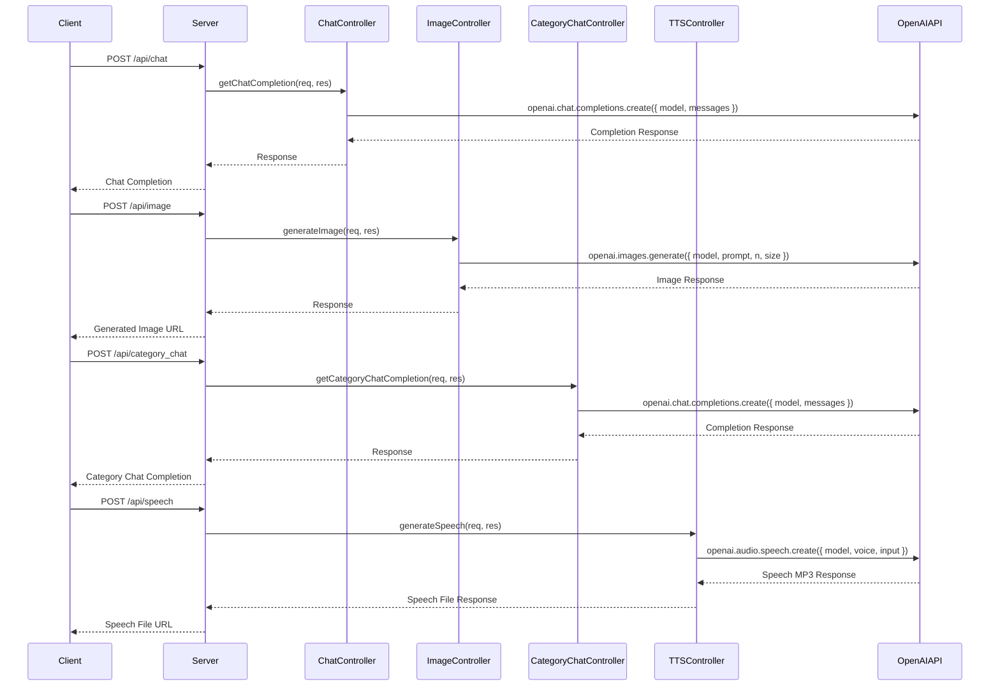

# RexGT: ChatGPT-powered Chat Service
> Empowering AI-Powered Apps with Real-Time Text, Images, and Speech.

## Features
- Native Prompt Category : RexGT supports 250+ roles including 50+ categories and over 100+ built in prompts on one endpoint to complete GPT queries efficently.
- Text Completions: Send text prompts with the RexGT API and receive text completions powered by OpenAI's ChatGPT.
- Image Generations: Send image prompts to the RexGT API and receive URLs of the generated images.
- Speech Synthesis: Convert text into speech and receive a URL to download the generated speech file.
- Flexible Configuration: Customize the temperature and other parameters of the text completions to fine-tune the output.
- Validation with Joi: The API validates the request payloads using the Joi library to ensure data integrity.
- Error Handling: Proper error handling is implemented to gracefully handle any errors that occur during communication with the OpenAI API or processing the requests.

## How RexGT Works


> RexGT is a service boilerplate that utilizes OpenAI's ChatGPT to provide text completions, image generations, and speech synthesis based on user prompts.

```sh
{
    "index": 0,
    "message": {
        "role": "assistant",
        "content": "In 2024, AI assistance is designed to enhance productivity, efficiency, and convenience across various sectors. Its primary purposes include automating routine tasks, providing intelligent insights through data analysis, personalizing user experiences, and improving decision-making processes. AI assistance aims to augment human capabilities in fields such as healthcare, customer service, education, and more, facilitating smarter and faster solutions to complex problems. It also focuses on enhancing usability and accessibility, ensuring that technological benefits are widely available to diverse populations. Overall, AI assistance seeks to streamline operations and improve quality of life through advanced, adaptive technologies."
    },
    "logprobs": null,
    "finish_reason": "stop"
}
```

> RexGT offers a custom backend API allowing users to interact with the latest GPT-4 omni-model and receive text completions, generated images, and synthesized speech. 

## Installation

1. Clone the repository: `git clone https://github.com/Marcus-Johnson/rexgt.git`
2. Install the dependencies: `npm i`
3. Set up the environment: Create a `.env` file and provide the necessary environment variables, including
   `OPENAI_KEY`, 
   `USERPROFILE`,
   `NODE_ENV`.
   `PORT`,
   
5. Start the server: `npm start`

# Content Generation
## Endpoint: /api/generate_category_text
- Method: POST
- Description: Supports 250+ roles including 50+ categories and over 100+ built in prompts on one endpoint.
```
curl --location --request POST 'http://localhost:3000/api/generate_category_text' \
--header 'Content-Type: application/json' \
--data-raw '{
  "category": "movie-script",
  "role": "director"
}'
```

## Endpoint: /api/generate_prompt_image
- Method: POST
- Description: Generate an image based on a provided prompt.
```
curl --location --request POST 'http://localhost:3000/api/generate_prompt_image' \
--header 'Content-Type: application/json' \
--data-raw '{
  "prompt": "sunset over the ocean",
  "n": 1,
  "size": "1024x1024"
}'
```

## Endpoint: /api/get_chat_completion
- Method: POST
- Description: Get a constant stream of chat completions with context memory based on a provided prompt.
```
curl --location --request POST 'http://localhost:3000/api/get_chat_completion' \
--header 'Content-Type: application/json' \
--data-raw '{
  "prompt": "Summarize yesterdays notes we spoke about."
}'
```

## Endpoint: /api/generate_speech
- Method: POST
- Description: Convert text into speech and receive a 200 when the file `speech.mp3` is downloaded to the main directory.
```
curl --location --request POST 'http://localhost:3000/api/generate_speech' \
--header 'Content-Type: application/json' \
--data-raw '{
  "text": "Beyond earth, in a far away Galaxy, There is RexGT!"
}'
```